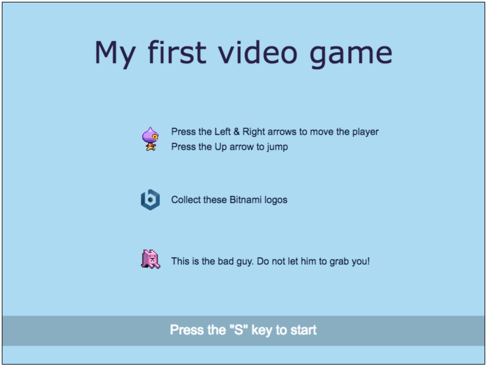

# My first videogame using Phaser and Bitnami
A simple example of how to implement a videogame using [Phaser - HTML5 Game Framework](https://github.com/photonstorm/phaser) and [Bitnami Apache Docker Image](https://github.com/bitnami/bitnami-docker-apache) with a docker-compose image.



## TL;DR
```bash
git clone https://github.com/cscazorla/phaser-bitnami.git
cd phaser-bitnami
docker-compose up
```
Access your web server in the browser by navigating to [http://localhost:8080](http://localhost:8080/) and start playing.

## Introduction
The main goal of this tutorial is to help people to start developing videogames in the browser. Thanks to [Bitnami Docker Images](https://bitnami.com/docker) we can forget about setting up the infrastructure (i.e. Apache web server) and focus on developing the game.

[Phaser](http://phaser.io/) is an HTML5 game framework which aims to help developers make powerful, cross-browser HTML5 games really quickly and, unlike some others, has solely been built to work with the mobile browsers.

This videogame is based on the [Making your first Phaser game tutorial](http://phaser.io/tutorials/making-your-first-phaser-game) but it has some extra improvements features like stages (which allows you to organize your code while also adding a more complete and dynamic gaming experience for the player) and a "bad guy" who tries to catch you.

## Codebase
The [docker-compose.yml](./docker-compose.yml) file is in charge of booting up the container and mounting the volume. Hence you don't need to take care of anything else.

The codebase of the game is at the [App](.app/) folder. The game is composed by three stages:
- Boot ([boot.js](app/js/boot.js)), which is in charge of preloading the assets.
- Menu ([menu.js](app/js/menu.js)), which shows a frontpage before the game begins.
- Play ([play.js](app/js/play.js)), this is the actual game.

The [index.html](app/index.html) file is in charge of preparing the HTML template and loading the Javascript libraries.

Although you might think there is a lot of code, it should all be pretty readable (there are a lot of comments). If you get stuck don't hesitate to read the [original tutorial](http://phaser.io/tutorials/making-your-first-phaser-game).

## Next steps
Are you comfortable with this code? Would like to improve the game? Here you are a few challenges:
- Implement a victory message when all Bitnami logos are collected.
- Make the baddie jump randomly when chasing you.
- Add a button for pausing the game.
- Add a debug environment.
